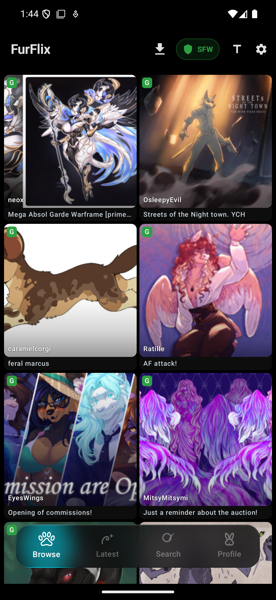
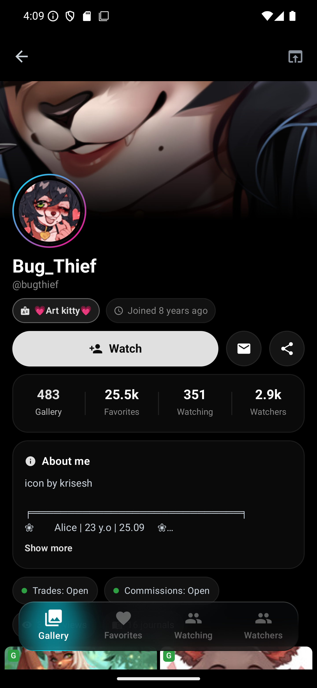
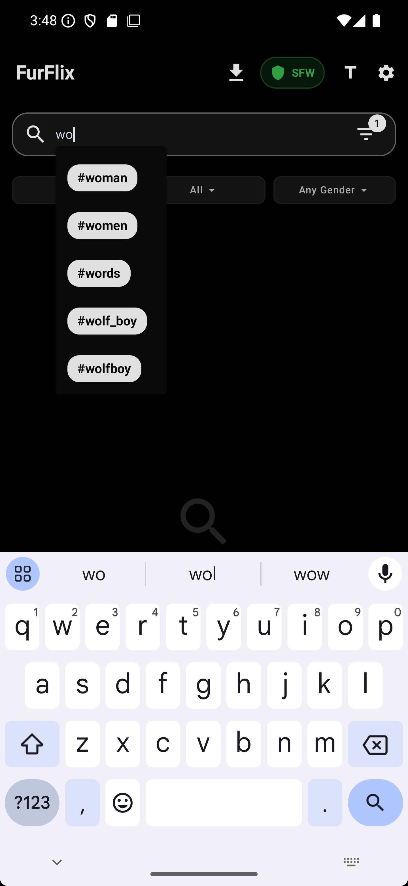
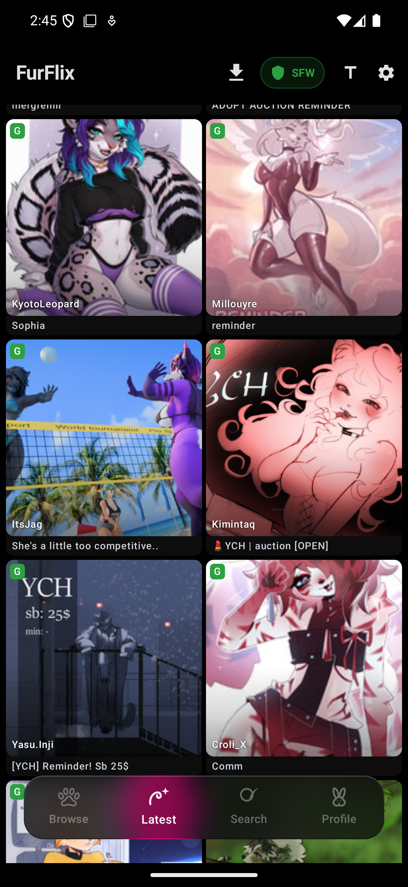
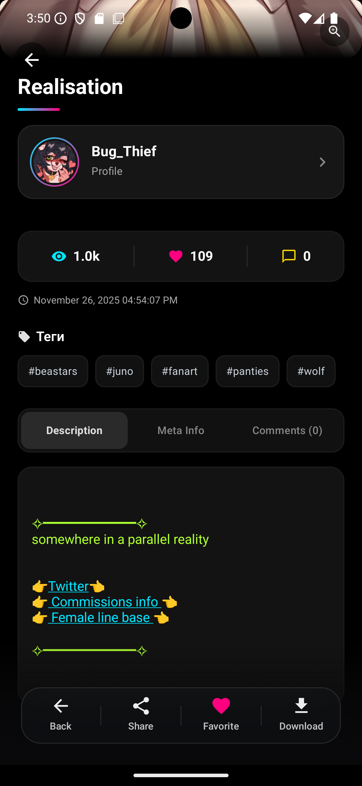
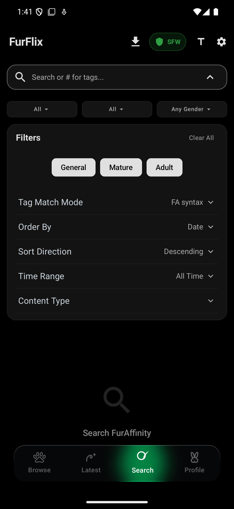
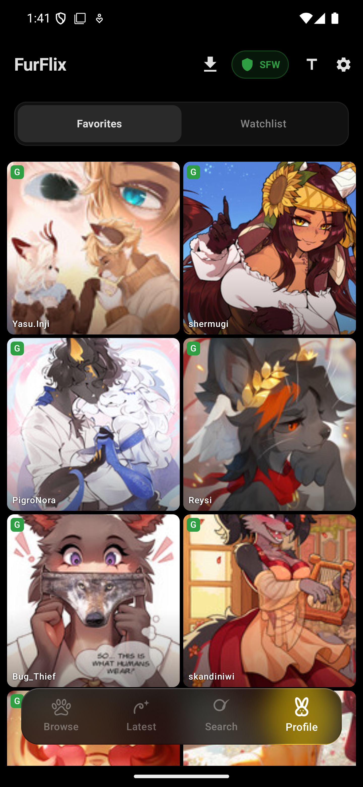
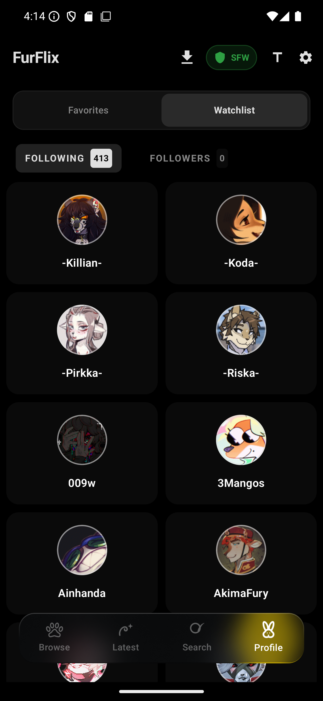
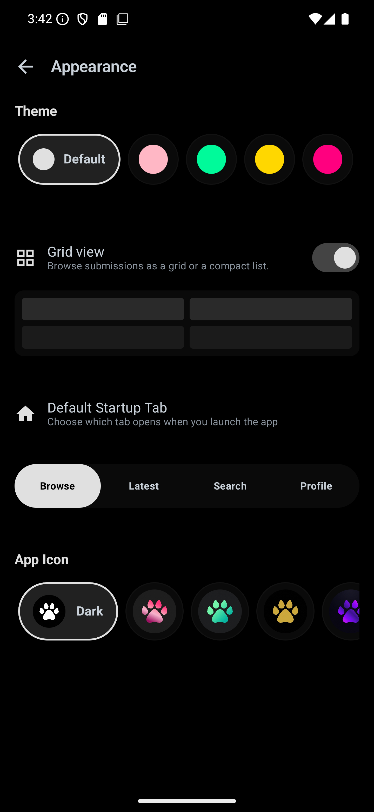

# FurFlix

<p align="center">
  <a href="https://furrychx.github.io/FurFlix-client-for-Android/">🌐 Официальный сайт приложения</a>
</p>

<p align="center">
  
</p>

<p align="center">
  
  
  
</p>

<p align="center"><a href="README.md">English</a> · <a href="README_RU.md">Русский</a> · <a href="README_UA.md">Українська</a></p>

Неофициальный клиент FurAffinity для Android — быстрый, современный, на Jetpack Compose.

> Не связан с FurAffinity или IMVU Inc.

---

## Скриншоты

<p align="center">

<table align="center">
<tr>
  <td align="center" width="200"><b>Browse</b><br></td>
  <td align="center" width="200"><b>Профиль</b><br></td>
  <td align="center" width="200"><b>Автодополнение тегов</b><br></td>
</tr>
</table>

</p>

<details>
<summary><b>Показать все скриншоты</b></summary>
<br>

<p align="center">

<table align="center">
<tr>
  <td align="center" width="200"><b>Browse</b><br></td>
  <td align="center" width="200"><b>Latest</b><br></td>
  <td align="center" width="200"><b>Инфо</b><br></td>
</tr>
<tr>
  <td align="center" width="200"><b>Поиск</b><br></td>
  <td align="center" width="200"><b>Автодополнение тегов</b><br></td>
  <td align="center" width="200"><b>Профиль</b><br></td>
</tr>
<tr>
  <td align="center" width="200"><b>Профиль</b><br></td>
  <td align="center" width="200"><b>Избранное</b><br></td>
  <td align="center" width="200"><b>Настройки</b><br></td>
</tr>
</table>

</p>
</details>

---

## Возможности

### 📱 Лента
Бесконечный скролл, сетка или список. Войди в аккаунт — получи ленту от отслеживаемых художников.

### 🔍 Поиск
Полнотекстовый и по тегам, с автодополнением (200K+ тегов офлайн). Фильтры по рейтингу, типу, категории, виду, полу, сортировке и периоду.

### 🖼️ Просмотр постов
Карточка с изображением, автором, статистикой, тегами, описанием, комментариями. Свайп между постами, пинч-зум и панорамирование.

### 👤 Профили и подписки
Профили художников: галерея, избранное, подписки и подписчики. Один тап — в избранное или отслеживаемые.

### ⬇️ Загрузки
Сохраняй изображения с метаданными в отдельном разделе.

### 🔒 Фильтры контента
Заглушай слова в заголовках, отключай NSFW.

### 🎨 Оформление
8 цветовых тем, 8 стилей иконки, 3 языка (EN/RU/UA), glassmorphism-интерфейс с эффектами размытия.

---

## Поддержка

FurFlix разрабатывается одним человеком. Если приложение полезно:

<p>


</p>

<details>
<summary><b>Monobank</b> — Visa / Mastercard</summary>
<br>

| Валюта | Карта |
|---|---|
| UAH | `4874 1000 3088 2800` |
| USD | `4874 1000 8642 3608` |
| EUR | `4441 1144 9001 3347` |

Google Pay · [Monobank Jar](https://send.monobank.ua/jar/31dqVo9pHr)
</details>

<details>
<summary><b>USDT (TRC20)</b></summary>
<br>

```
TVX7biFztNzd2P85y8iDGTN6uLyuduGEj7
```
</details>

<details>
<summary><b>Bitcoin (BTC)</b></summary>
<br>

```
12mRZTgc1dPr8iqPmzuwszKK7Ee9uQafwX
```
</details>

---

## Связь

<a href="https://t.me/PavelFurrych"></a>
<a href="https://x.com/Furrych"></a>


---

*Сторонний клиент. Используйте на своё усмотрение и в соответствии с условиями FurAffinity.*
